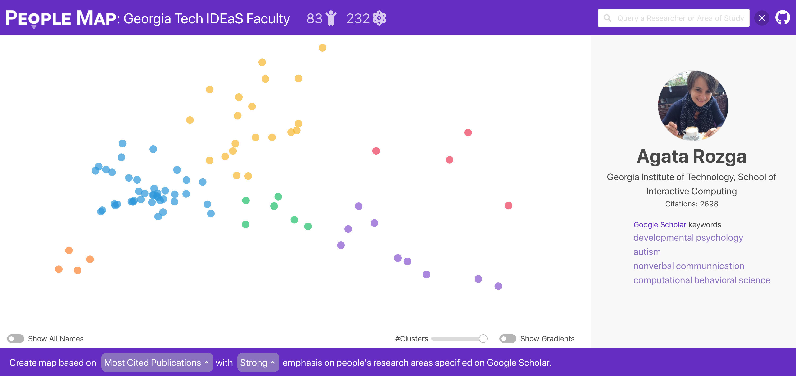

# PeopleMap

A visualization tool that visually “maps out” researchers based on their research interests and publications, based on embeddings generated by natural language processing (NLP) techniques

Discovering research expertise at institutions can be a difficult task. Manually curated university directories easily become out of date and often lack the information necessary to understand a researcher’s interests and past work, making it harder to explore the diversity of research at an institution and pinpoint potential collaborators. PeopleMap solves these problems! To generate a PeopleMap, you only need to provide the researchers’ Google Scholar profile URLs.

**Live Demos**: https://poloclub.github.io/people-map/ideas/ & https://poloclub.github.io/people-map/ml/                                                 
**Video**: https://www.youtube.com/watch?v=kfKOoR4H1PE                                                                       
**Documentation**: https://poloclub.gitbook.io/people-map/                                                                             

Brought to you by [Jon Saad-Falcon](https://www.linkedin.com/in/jonsaadfalcon/), [Omar Shaikh](https://www.linkedin.com/in/oshaikh13/), [Jay Wang](https://zijie.wang/), [Austin Wright](https://austinpwright.com/), [Sasha Richardson](https://www.linkedin.com/in/sasha-richardson/), and [Polo Chau](https://poloclub.github.io/polochau/).


[**Mapping Researchers with PeopleMap**](https://arxiv.org/abs/2009.00091)                                                   
Jon Saad-Falcon, Omar Shaikh, Jay Wang, Austin Wright, Sasha Richardson, and Polo Chau                                                       
*2020 IEEE Visualization (VIS'20)*

[**PeopleMap: Visualization Tool for Mapping Out Researchers using Natural Language Processing**](https://arxiv.org/abs/2006.06105)                                         
Jon Saad-Falcon, Omar Shaikh, Jay Wang, Austin Wright, Sasha Richardson, and Polo Chau                                                    
arXiv Preprint                                                                                                                  

<br/>
<a href="https://poloclub.github.io/people-map/ideas/" target="_blank"></a>


# Live Demo
Click the following links to access two live demos:

https://poloclub.github.io/people-map/ideas/

https://poloclub.github.io/people-map/ml/

We have tested PeopleMap on Google Chrome, Firefox, Safari. It should run on all modern web browsers.

# Development
For steps on how to set up and deploy PeopleMap, please see PeopleMap's GitBook documentation at:

https://poloclub.gitbook.io/people-map/

# Credit
PeopleMap was created by [Jon Saad-Falcon](https://www.linkedin.com/in/jonsaadfalcon/), [Omar Shaikh](https://www.linkedin.com/in/oshaikh13/), [Jay Wang](https://zijie.wang/), [Austin Wright](https://austinpwright.com/), [Sasha Richardson](https://www.linkedin.com/in/sasha-richardson/), and [Polo Chau](https://poloclub.github.io/polochau/) from Georgia Tech. 

We thank everyone in the [Polo Club of Data Science](http://poloclub.gatech.edu) for assisting us in the development of the project.

# License

The software is available under the [MIT License](https://github.com/poloclub/people-map/blob/master/LICENSE).

# Citations

```
@misc{saadfalcon2020mapping,
      title={Mapping Researchers with PeopleMap}, 
      author={Jon Saad-Falcon and Omar Shaikh and Zijie J. Wang and Austin P. Wright and Sasha Richardson and Duen Horng Chau},
      year={2020},
      eprint={2009.00091},
      archivePrefix={arXiv},
      primaryClass={cs.DL}
}
```

```
@misc{saadfalcon2020peoplemap,
      title={PeopleMap: Visualization Tool for Mapping Out Researchers using Natural Language Processing}, 
      author={Jon Saad-Falcon and Omar Shaikh and Zijie J. Wang and Austin P. Wright and Sasha Richardson and Duen Horng Chau},
      year={2020},
      eprint={2006.06105},
      archivePrefix={arXiv},
      primaryClass={cs.DL}
}
```


# Contact

If you have any questions, feel free to [open an issue](https://github.com/poloclub/people-map/issues) or contact [Jon Saad-Falcon](https://www.linkedin.com/in/jonsaadfalcon/).
