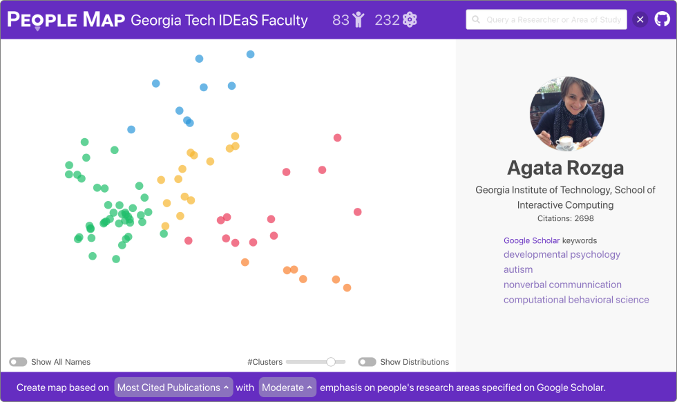

# PeopleMap: Visualization Tool for Mapping Out Researchers using Natural Language Processing
By [Jon Saad-Falcon](https://www.linkedin.com/in/jonsaadfalcon/), [Omar Shaikh](https://www.linkedin.com/in/oshaikh13/), [Jay Wang](https://zijie.wang/), [Austin Wright](https://austinpwright.com/), and [Polo Chau](https://poloclub.github.io/polochau/).

# Overview
PeopleMap is an interactive, web-based tool that uses natural language processing (NLP) techniques to improve the accuracy of the information and characterization of researchers. The tool maps out researchers through graphical representations that make use of a variety of textual characteristics related to each researcher, such as college/school of their professorship, laboratory affiliation, titles and abstracts of their papers found on Google Scholar, and Google Scholar keywords. 

By analyzing this information through a variety of natural language processing techniques, such as NMF and TFIDF, we can get a better understanding of the topics and focuses related to the variety of academic researchers. These connections and groups can, in turn, be visualized through a graphical system of nodes and clusters that builds a more intuitive image of the researchers, which helps us understand the vastness of academic diversity better.

# Live Demo
Click the following links to access two live demos:

https://poloclub.github.io/people-map/ideas/

https://poloclub.github.io/people-map/ml/

They run on most web browsers. We suggest you use Google Chrome or Firefox.

# Development
For steps on how to download and set up PeopleMap, please go to the following documentation site:

https://app.gitbook.com/@poloclub/s/people-map/

# Credit
PeopleMap was created by [Jon Saad-Falcon](https://www.linkedin.com/in/jonsaadfalcon/), [Omar Shaikh](https://www.linkedin.com/in/oshaikh13/), [Jay Wang](https://zijie.wang/), [Austin Wright](https://austinpwright.com/), and [Polo Chau](https://poloclub.github.io/polochau/). We would also like to thank everyone in the Polo Club of Data Science for assisting us in the development of the project.

# License

The software is available under the [MIT License](https://github.com/poloclub/people-map/blob/master/LICENSE).

# Contact

If you have any questions, feel free to [open an issue](https://github.com/poloclub/people-map/issues) or contact [Jon Saad-Falcon](https://www.linkedin.com/in/jonsaadfalcon/).
